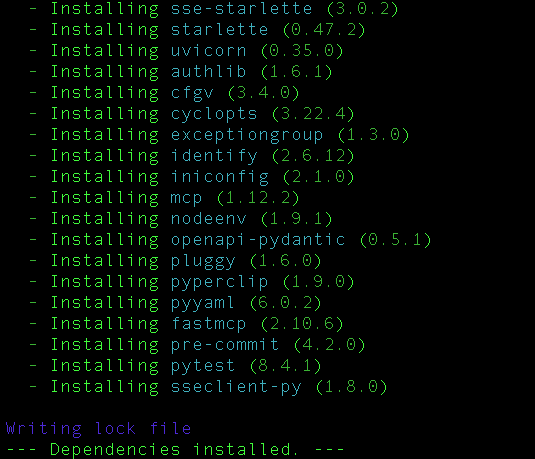
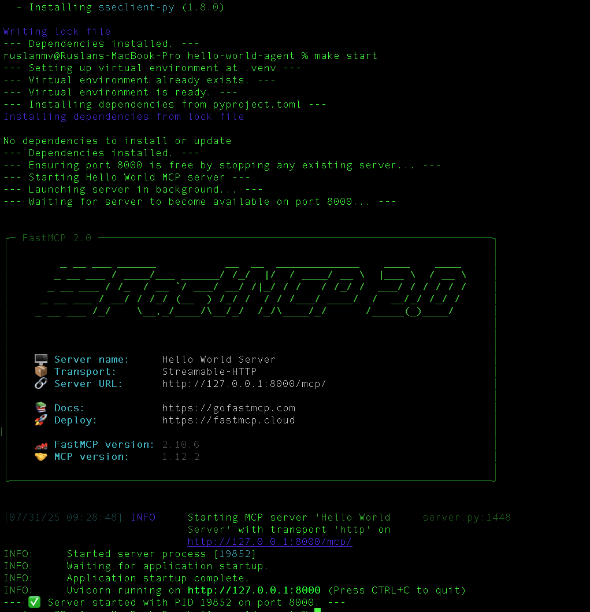
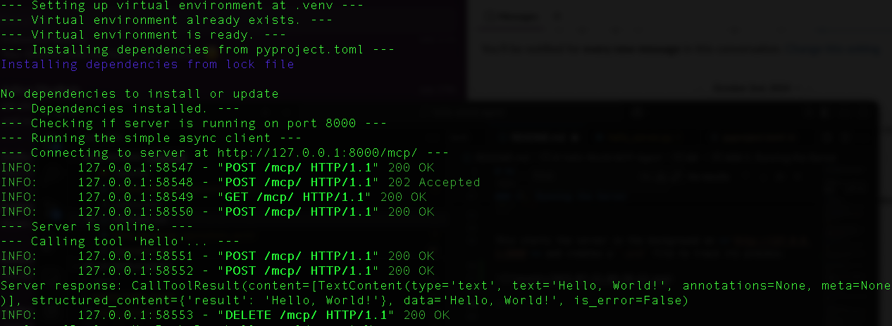

# Hello World MCP Agent

This project provides a simple "Hello World" agent built using the **`fastmcp`** framework. It exposes a single tool, **`hello`**, which returns a greeting to a given name.

## 📂 File Structure

```
.
├── agents/
│   └── hello_world/
│       ├── hello_server.py   # The main agent server script
│       └── simple_client.py  # A simple client to test the server
├── Makefile                  # Automation for setup, running, and testing
├── pyproject.toml            # Python project dependencies
├── poetry.lock               # Exact versions of dependencies
└── README.md                 # This file
```

## ✅ Requirements

  * Python 3.11 or later
  * `make` command-line utility

## 🚀 Getting Started

This project uses `poetry` for dependency management and a `Makefile` to simplify common tasks.

### 1\. Setup and Installation

To get started, create a Python virtual environment and install the required dependencies using the `Makefile`.

From your terminal, run:

```bash
make install
```

This command automates the entire setup process:

1.  Creates a Python virtual environment in a folder named `.venv`.
2.  Installs `poetry` into the environment.
3.  Uses `poetry` to install all project dependencies specified in `pyproject.toml`.


-----

### 2\. Running the Server

Once the installation is complete, start the agent server.

```bash
make start
```

This starts the server in the background on **`http://127.0.0.1:8000`** and creates a `.pid` file to track its process.



-----

### 3\. Running the Client

With the server running, you can use the provided client script to interact with the agent.

```bash
make run-client
```

This will execute `simple_client.py`, which calls the `hello` tool and prints the server's response. You should see the following output:

```
--- Connecting to server at http://127.0.0.1:8000/mcp/ ---
--- Server is online. ---
--- Calling tool 'hello'... ---
Server response: Hello, World!
```

-----

### 4\. Stopping the Server

To stop the running server process, use the following command:

```bash
make stop
```

## 🛠️ Agent Tool

The agent provides one simple tool:

  * **`hello(name: str) -> str`**: This tool accepts a `name` as a string and returns a greeting, for example, `"Hello, <name>!"`.

## Makefile Commands

The `Makefile` provides several commands for convenience. Run `make help` to see the list.

| Command | Description |
| :--- | :--- |
| `make install` | Installs all project dependencies. |
| `make start` | Starts the agent server, stopping any existing instance first. |
| `make stop` | Stops the agent server. |
| `make restart` | Restarts the agent server. |
| `make run-client` | Runs the simple client to test the `hello` tool. |
| `make clean` | Stops the server and removes the virtual environment, `.pid` file, and `poetry.lock` file. |